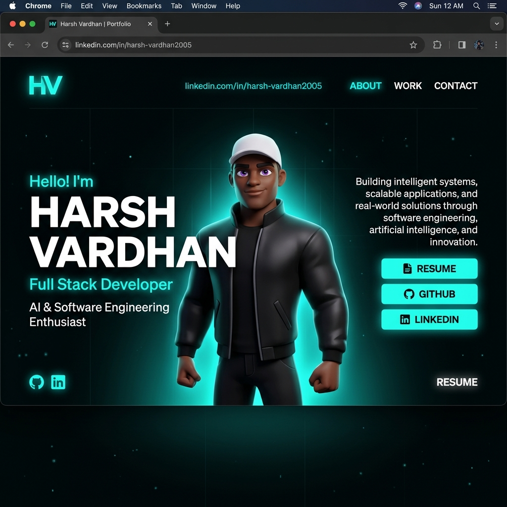

# 🚀 Harsh Vardhan — AI-Powered 3D Developer Portfolio

A cutting-edge personal portfolio built with **React**, **TypeScript**, **Three.js**, **React Three Fiber**, and **GSAP** — featuring a physics-based 3D character scene, floating interactive tech icons, an Innovation Journey timeline, and smooth scroll-driven animations.

> 🌐 **Live Site:** [https://harshvardhan.netlify.app/](https://clever-sundae-dc717c.netlify.app/)  
> 📧 **Email:** harishvardhanm24cs@psnacet.edu.in  
> 💼 **LinkedIn:** [linkedin.com/in/harsh-vardhan2005](https://linkedin.com/in/harsh-vardhan2005)  
> 🐙 **GitHub:** [github.com/harishvardhanm24cs-glitch](https://github.com/harishvardhanm24cs-glitch)



---

## 📋 Table of Contents

- [About](#about)
- [Features](#features)
- [Tech Stack](#tech-stack)
- [Sections](#sections)
- [Project Structure](#project-structure)
- [Getting Started](#getting-started)
- [Available Scripts](#available-scripts)
- [GSAP License Note](#gsap-license-note)
- [Customization Guide](#customization-guide)
- [Troubleshooting](#troubleshooting)
- [Deployment](#deployment)
- [License](#license)

---

## 👨‍💻 About

Hi, I'm **Harsh Vardhan**, a CSE student at **PSNA College of Engineering and Technology**. I'm passionate about building intelligent, full-stack applications powered by AI/ML and modern web technologies. This portfolio showcases my skills, projects, innovation journey, and professional background through an immersive 3D experience.

---

## ✨ Features

- ⚡ **3D Interactive Character** — Physics-based character scene powered by React Three Fiber + Rapier
- 🧠 **Floating Skills Canvas** — 14 tech icons with real-time physics simulation (pauses when off-screen to save GPU)
- 🏆 **Innovation Journey Timeline** — Vertical animated milestone timeline (Samsung, ISRO, Pitch Festival)
- 📬 **Interactive Contact Form** — With loading/success states and one-click clipboard copy
- 🎨 **Glassmorphism Design** — Dark-mode aesthetic with neon-accented hover glows
- 📱 **Fully Responsive** — Optimized for mobile, tablet, and desktop
- ⚡ **Performance Optimized** — WebP assets, lazy-loaded 3D canvas, parallel font preloading
- ♿ **Accessible** — `aria-label` on all interactive elements

---

## 🛠️ Tech Stack

### Core

- React 18
- TypeScript
- Vite

### Animation & 3D

- GSAP + `@gsap/react` + ScrollTrigger + SplitText
- Three.js
- `@react-three/fiber`
- `@react-three/drei`
- `@react-three/postprocessing`
- `@react-three/rapier`

### Languages & Frameworks Showcased

`Python` · `Java` · `C++` · `React` · `Node.js` · `Express.js` · `MongoDB` · `MySQL` · `FastAPI` · `TensorFlow` · `PyTorch` · `Docker` · `GitHub` · `Postman`

### Supporting Libraries

- `react-icons`
- `react-fast-marquee`
- `@vercel/analytics`

---

## 📂 Sections

| Section | Description |
|---------|-------------|
| **Hero / Landing** | 3D character, animated intro, resume download |
| **About** | Personal background and introduction |
| **What I Do** | Services and areas of expertise |
| **Skills** | Physics-based floating tech icons + professional skill badges |
| **Career** | Education and experience timeline |
| **Achievements** | Awards, certifications, and milestones |
| **Innovation Journey** | Samsung · ISRO · Pitch Festival · Startup experience |
| **Work / Projects** | Featured project showcases |
| **Tech Stack** | Interactive 3D tech stack marquee |
| **Contact** | Form + social links with clipboard copy |

---

## 🗂️ Project Structure

```text
.
├── public/
│   ├── images/              # WebP-optimized assets & project screenshots
│   ├── models/              # Encrypted 3D character model + HDR environment
│   ├── draco/               # Draco decoder for compressed geometry
│   └── Harsh_Vardhan.pdf    # Resume
├── src/
│   ├── assets/              # Local SVG/media assets
│   ├── components/
│   │   ├── Character/       # 3D scene + character logic & utilities
│   │   ├── styles/          # Per-component CSS modules
│   │   ├── About.tsx
│   │   ├── Achievements.tsx
│   │   ├── Career.tsx
│   │   ├── Contact.tsx
│   │   ├── InnovationJourney.tsx
│   │   ├── Landing.tsx
│   │   ├── MainContainer.tsx   # Root page composition
│   │   ├── Navbar.tsx
│   │   ├── Skills.tsx
│   │   ├── SocialIcons.tsx
│   │   ├── TechStack.tsx
│   │   ├── WhatIDo.tsx
│   │   └── Work.tsx
│   ├── context/             # Global providers (loading state, etc.)
│   ├── data/                # Static data & content definitions
│   ├── utils/               # GSAP scroll, split text, initial FX
│   ├── App.tsx
│   └── main.tsx
├── package.json
└── vite.config.ts
```

---

## 🚀 Getting Started

### Prerequisites

- Node.js 18+ (recommended)
- npm 9+ (or compatible)

### Installation

1. Clone the repository:

   ```bash
   git clone https://github.com/harishvardhanm24cs-glitch/Portfolio.git
   cd Portfolio
   ```

2. Install dependencies:

   ```bash
   npm install
   ```

3. Start the local development server:

   ```bash
   npm run dev
   ```

4. Open the URL shown in the terminal (typically `http://localhost:5173`).

---

## 📜 Available Scripts

| Script | Description |
|--------|-------------|
| `npm run dev` | Starts Vite dev server with hot reload |
| `npm run build` | Type-checks and builds production bundle |
| `npm run preview` | Serves the production build locally |
| `npm run lint` | Runs ESLint checks across the project |

---

## 📝 GSAP License Note

This project uses the standard `gsap` package including bonus plugins now bundled in the core.

- Install with `npm install` — no extra GSAP config needed.
- If migrating from older setups, remove `gsap-trial` from your project.

Read the official docs: [GSAP Installation Guide](https://gsap.com/docs/v3/Installation/)

---

## 🎨 Customization Guide

Fork and personalize this portfolio by updating:

- **Personal info**: `src/components/Landing.tsx`, `src/components/About.tsx`
- **Career & experience**: `src/components/Career.tsx`
- **Projects**: `src/components/Work.tsx`
- **Innovation milestones**: `src/components/InnovationJourney.tsx`
- **Skills & tech icons**: `src/components/Skills.tsx`, `src/components/TechStack.tsx`
- **Contact details**: `src/components/Contact.tsx`, `src/components/SocialIcons.tsx`
- **Resume**: Replace `public/Harsh_Vardhan.pdf` with your own PDF
- **Styles**: `src/components/styles/` + `src/index.css`
- **3D scene**: `src/components/Character/`
- **Animations**: `src/components/utils/GsapScroll.ts`

---

## 🔧 Troubleshooting

- **Blank screen in development**  
  Check browser console for module import errors and verify all dependencies are installed.

- **3D performance issues on low-end devices**  
  The Skills canvas automatically pauses when scrolled out of view. For further optimization, reduce scene complexity in `Character/Scene.tsx`.

- **GSAP plugin errors**  
  Ensure you're on the latest `gsap` package. Run `npm install gsap@latest`.

- **TypeScript build failures**  
  Run `npm run build` and address reported type errors before deploying.

- **Horizontal scrollbar on Windows**  
  Avoid `100vw` in CSS — use `100%` instead (already applied throughout this project).

---

## 🌍 Deployment

1. Create a production build:

   ```bash
   npm run build
   ```

2. Validate locally:

   ```bash
   npm run preview
   ```

3. Deploy the generated `dist/` folder to your hosting provider:
   - **Vercel** — `vercel --prod`
   - **Netlify** — Drag & drop `dist/` or connect GitHub repo
   - **Cloudflare Pages** — Connect GitHub and set build command to `npm run build`

---

## 📄 License

This project is open source and available under the [MIT License](LICENSE).

---

<div align="center">

Built with ❤️ by **Harsh Vardhan**  
CSE Student @ PSNA College of Engineering & Technology  

[](https://linkedin.com/in/harsh-vardhan2005)
[](https://github.com/harishvardhanm24cs-glitch)
[](mailto:harishvardhanm24cs@psnacet.edu.in)

</div>
